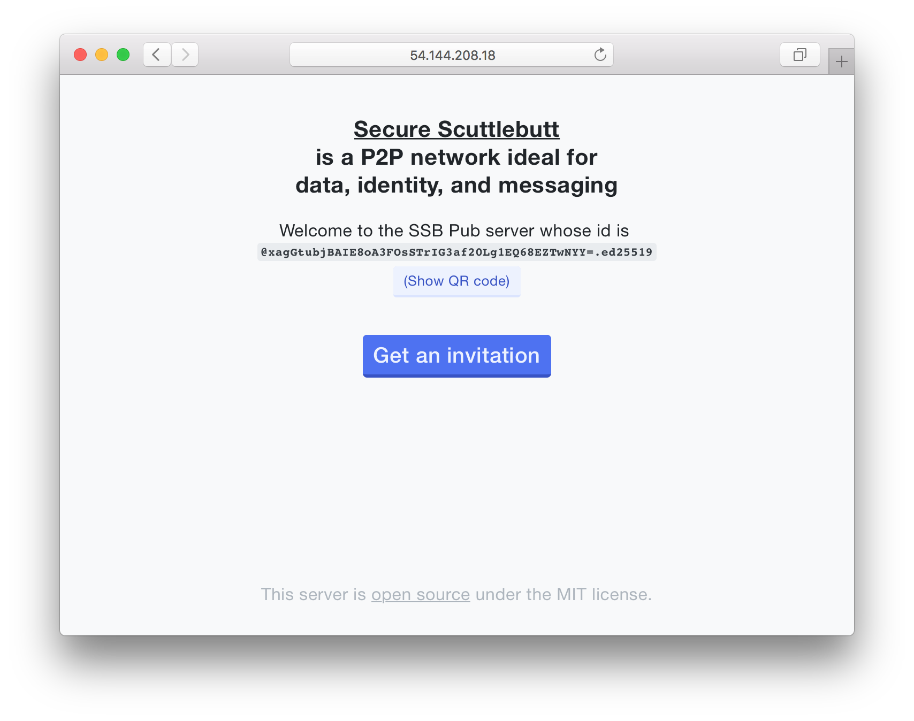

# Easy Secure Scuttlebutt Pub

> `easy-ssb-pub` is an easy-to-host server that runs an SSB "Pub".

[Secure Scuttlebutt](https://scuttlebot.io/) (SSB) is an impressive peer-to-peer network that can be used for metadata, identity, and particularly, messaging. SSB is an ideal protocol for a social network. There is already a social network on SSB, called [Patchwork](https://github.com/ssbc/patchwork).

However, to join the wider SSB network, you must get a dedicated invitation from a "Pub" server. Also, hosting a Pub server is not the easiest task. In order to improve adoption of SSB, this project makes it easy to deploy an SSB Pub. Once the Pub is running, it has a light frontend page where anyone can get freely request a fresh invitation.

## Visit one of these

#### If you want to visit an Easy SSB Pub, here are a few known links (potentially ephemeral or broken):

- [http://82.196.3.140/](http://82.196.3.140/)
- [http://pub.locksmithdon.net/](http://pub.locksmithdon.net/)
- [(add yours here)](https://github.com/staltz/easy-ssb-pub/edit/master/README.md)

## How to deploy

You will need a server that supports exposing ports other than just 80. This means [Heroku](https://heroku.com/) or [Zeit Now](https://zeit.co/now) will *not* work.

### Deploy using Docker

Recommended servers-on-demand services: [Digital Ocean Docker Droplet](https://www.digitalocean.com/products/one-click-apps/docker/), [Amazon LightSail](https://amazonlightsail.com/), [Vultr](https://vultr.com/), [Linode](https://www.linode.com), etc.

1. Access your server via shell (e.g. SSH)
3. `docker pull staltz/easy-ssb-pub`
4. `docker run -e "PUB_URL=publicurltoyourserv.er" -e "PORT=80" -p 80:80 -p 8008:8008 -i -t staltz/easy-ssb-pub`

### Deploy without Docker

1. Access your server via shell (e.g. SSH)
2. Install nvm: `curl -o- https://raw.githubusercontent.com/creationix/nvm/v0.33.0/install.sh | bash`
3. Restart the shell
4. `nvm install v6.9.1`
5. `git clone https://github.com/staltz/easy-ssb-pub.git`
6. `npm install`
7. `PORT=80 PUB_URL="publicurltoyourserv.er" npm start`
